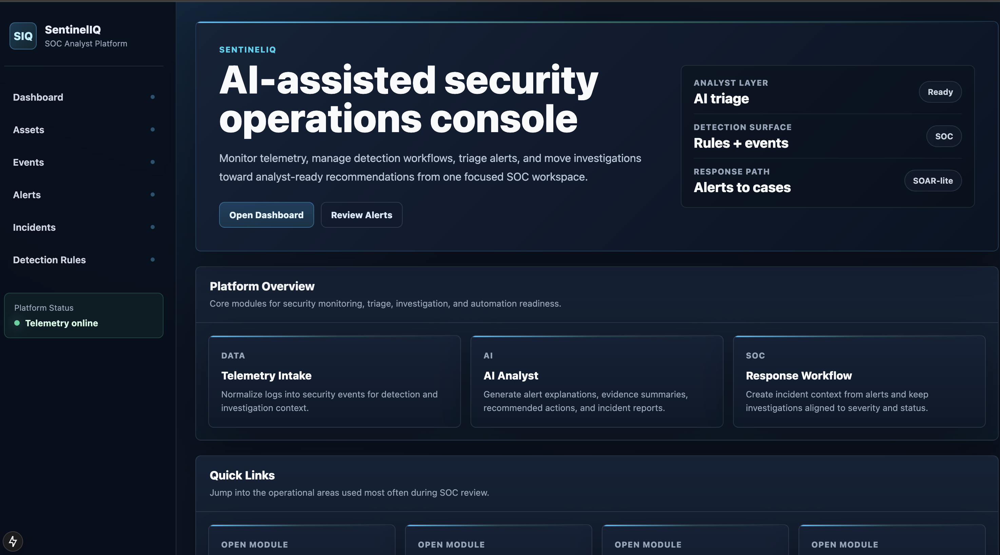
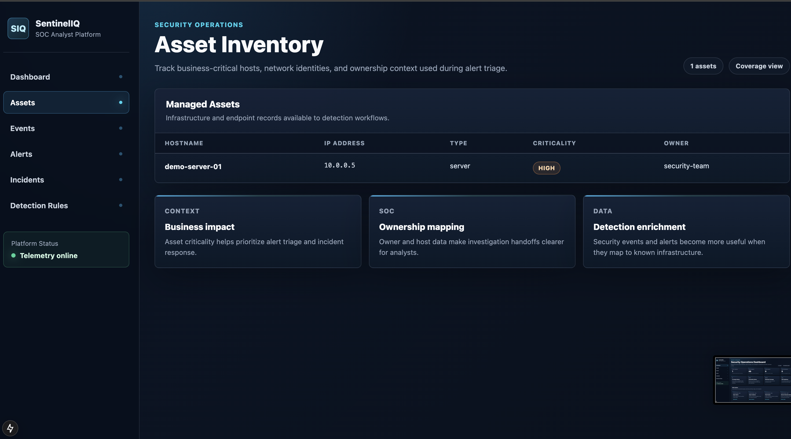
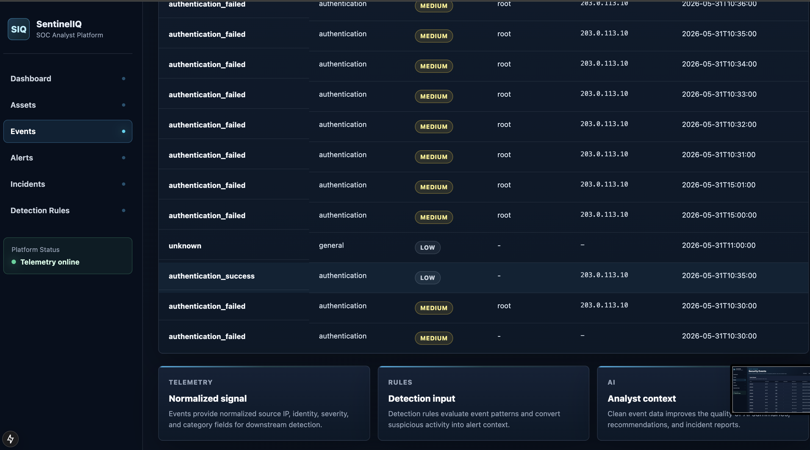
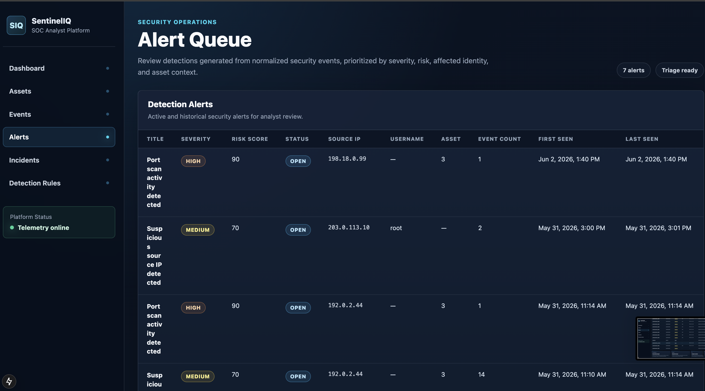
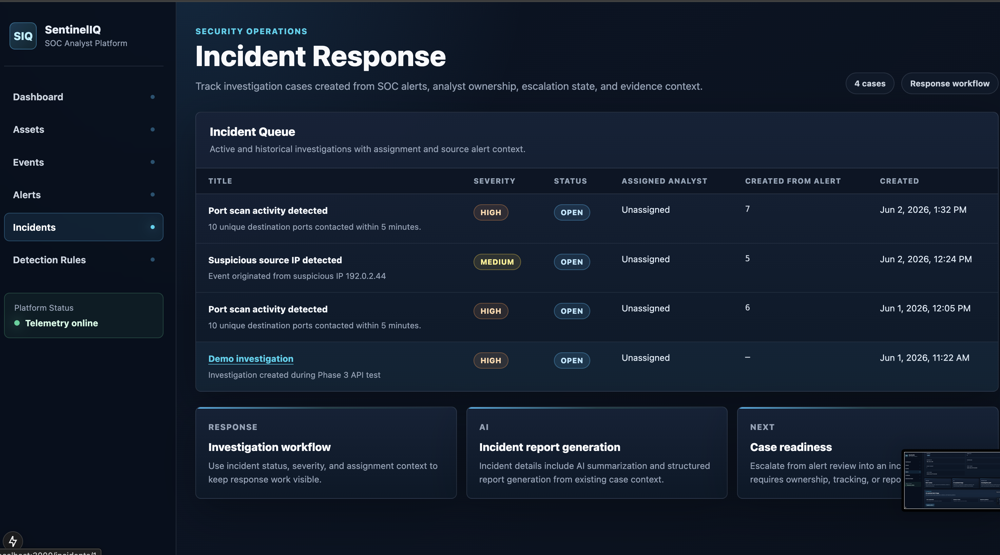
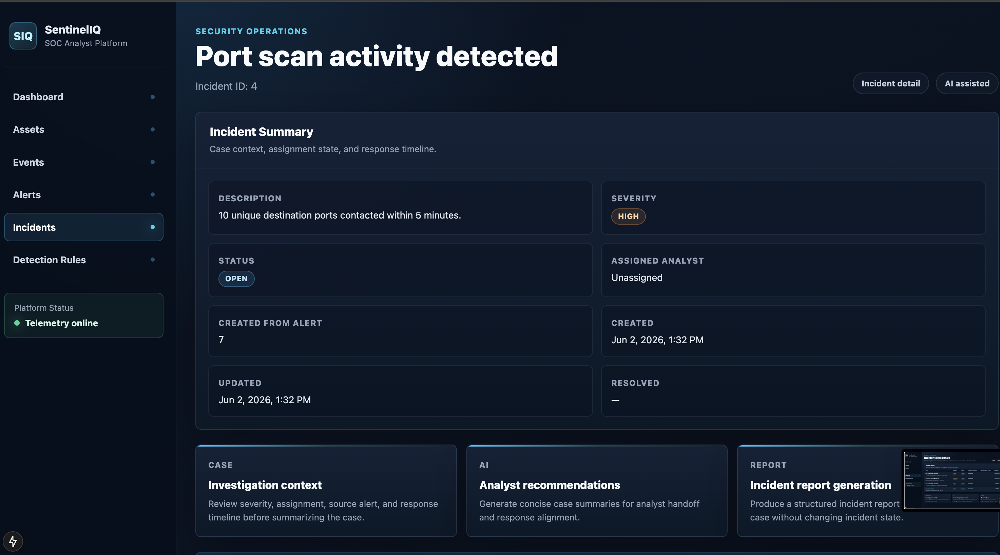
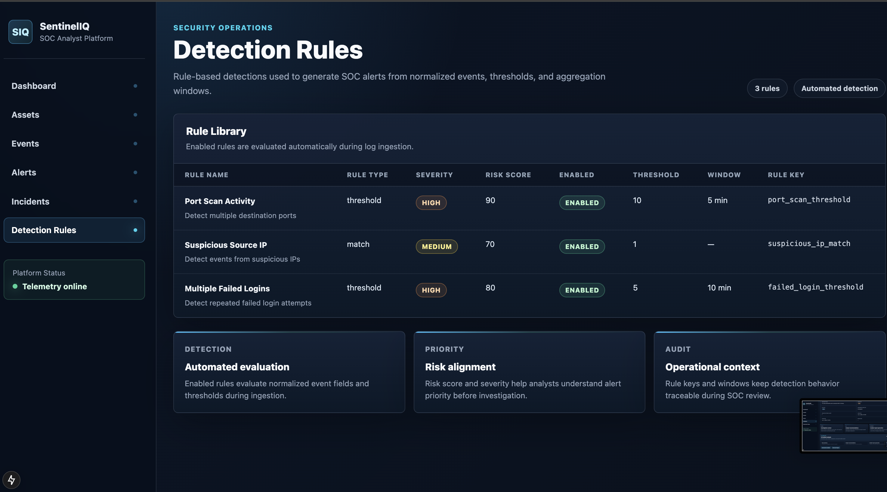

## Project Status

🚧 Active Development

Completed:
- SOC Core
- Detection Engine
- Investigation Workspace
- AI Analyst
- Automation Foundation

In Progress:
- Production Hardening
- RBAC
- Rate Limiting
- Observability


# SentinelIQ

SentinelIQ is an AI-assisted SOC and SOAR-lite platform built to demonstrate modern security platform engineering.

It combines log ingestion, detection engineering, alerting, incident investigation, AI-assisted analysis, automation, webhooks, and production-readiness practices into one full-stack security project.

---

## Current Status

```text
Phase 1 ✅ SOC Core
Phase 2 ✅ Detection Engine
Phase 3 ✅ Investigation Workspace
Phase 4 ✅ AI Analyst
Phase 5 ✅ Automation
Phase 6 ✅ Production Readiness
```

## SOC Workflow

<h2>SOC Workflow</h2>

<p align="center">
  <a href="docs/screenshots/SOC%20Workflow.png">
    
  </a>
</p>


## System Architecture

<h2>System Architecture</h2>

<p align="center">
  <a href="docs/screenshots/System%20Architecture.png">
    
  </a>
</p>
---

## Features

### SOC Core

* Organizations
* Users
* Assets
* Log sources
* Security events

### Detection Engine

* Failed login detection
* Port scan detection
* Suspicious IP detection
* Detection rules
* Alert generation
* Alert deduplication

### Investigation Workspace

* Incident management
* Alert-to-incident workflow
* Linked alerts
* Incident timeline
* Analyst notes
* Status tracking

### AI Analyst

* Alert explanation
* Incident summaries
* Incident report generation
* AI report persistence
* AI audit logging
* AI panels in the frontend

### Automation

* Webhook infrastructure
* Webhook delivery tracking
* Notification service
* Automation service
* Auto-create incidents for high-severity alerts
* n8n webhook integration
* Daily SOC summary

### Production Readiness

* Production Dockerfiles
* Production Docker Compose
* Environment-based configuration
* GitHub Actions CI
* Backend unit tests
* Secrets hygiene baseline

---

Frontend:

```text
Next.js
```

Backend:

```text
FastAPI
SQLAlchemy
Alembic
PostgreSQL
Redis
```

Automation:

```text
Webhook Service
Notification Service
Automation Service
n8n
```

---

## Tech Stack

### Frontend

* Next.js
* React
* TypeScript

### Backend

* FastAPI
* SQLAlchemy
* Alembic
* Pydantic
* PostgreSQL
* Redis

### Automation

* Webhooks
* n8n integration

### DevOps

* Docker
* Docker Compose
* GitHub Actions

---

## Local Development

Start the development environment:

```bash
docker compose up -d
```

Run database migrations:

```bash
docker compose exec backend alembic upgrade head
```

Open the application:

```text
Frontend: http://localhost:3000
Backend:  http://localhost:8000
Health:   http://localhost:8000/health
```

---

## Production-style Docker Run

Build production images:

```bash
docker compose -f docker-compose.prod.yml build
```

Start production-style containers:

```bash
docker compose -f docker-compose.prod.yml up -d
```

Verify backend health:

```bash
curl http://localhost:8000/health
```

---

## Core API Areas

```text
GET    /api/assets
GET    /api/events
GET    /api/detection-rules
GET    /api/alerts
GET    /api/incidents
POST   /api/alerts/{id}/create-incident
POST   /api/ai/alerts/{id}/explain
POST   /api/ai/incidents/{id}/summarize
POST   /api/ai/incidents/{id}/report
GET    /api/webhooks
POST   /api/webhooks
GET    /api/soc-summary/daily
```

---

## Testing

Run backend tests:

```bash
cd backend
python3 -m pytest
```

The GitHub Actions pipeline validates:

* Backend imports
* Backend tests
* Frontend production build
* Production Docker Compose config
* Production Docker image builds

---

## Security Notes

SentinelIQ includes:

* Pydantic request validation
* Audit logging for sensitive AI actions
* Webhook delivery tracking
* Environment-based configuration
* No committed `.env` files
* Placeholder-only `.env.example`
* Production Docker containers running as non-root users

See:

```text
docs/security.md
docs/threat-model.md
```

---

## Roadmap

Planned improvements:

* Authentication and RBAC enforcement
* Rate limiting
* Structured logging
* Prometheus metrics
* Expanded integration tests
* Deployment guide for cloud hosting
* Architecture diagram image
* Demo seed data

---

## Portfolio Purpose

SentinelIQ is designed as a security engineering portfolio project.

It demonstrates:

* Detection engineering
* Incident response workflows
* AI-assisted security analysis
* SOAR-lite automation
* Backend architecture
* Production-readiness practices


## Screenshots

### Home



### Dashboard


### Assets



### Events



### Alerts



### Alert Investigation


### Incidents



### Incident Investigation



### Detection Rules


